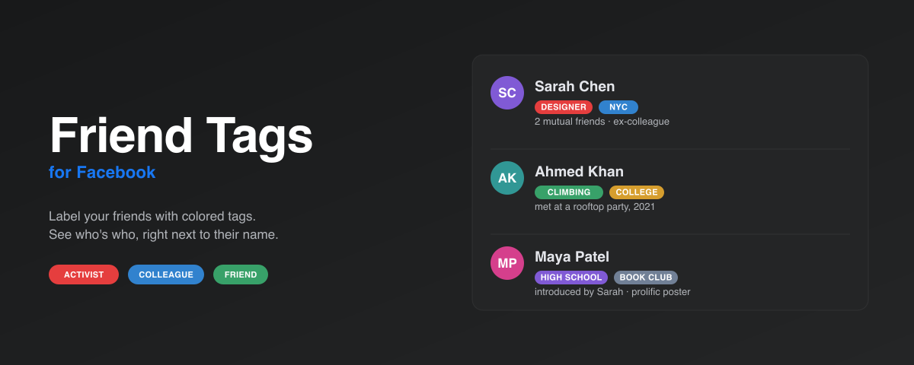

# Friend Tags for Facebook



A small Chrome extension that lets you tag your Facebook friends with colored labels. Tags appear inline next to their name on feed posts, comments, and profile pages — like a personal note-to-self about who's who.

> ## ⚠️ Disclaimer
>
> **This extension is NOT affiliated with, endorsed by, or connected to Meta Platforms, Inc. or Facebook in any way.** "Facebook" is a trademark of Meta. This is an independent, community-built tool.
>
> **Provided as-is, with no warranty of any kind.** Use at your own risk. See the [full license](#license) for terms. The authors are not liable for any account-related consequences, data loss, or breakage caused by changes to Facebook's website.
>
> All tagging happens locally in your own browser. The extension makes no network calls of its own and does not scrape Facebook's data.

## Videos

- 📦 **How to install** — https://cleanshot.com/share/lR92W7nq
- 🏷️ **How to use** — https://cleanshot.com/share/YhpqqkJ2

## Quick install (no git required)

🎬 [Watch the 60-second install video](https://cleanshot.com/share/lR92W7nq)

1. Download the [latest release zip](https://github.com/phpfour/fb-friend-tags/releases/latest).
2. Unzip it somewhere you won't accidentally delete (Documents works).
3. Chrome → `chrome://extensions` → turn on **Developer mode** (top right).
4. Click **Load unpacked** → pick the unzipped folder.
5. Pin it to your toolbar (Extensions puzzle icon → pin "Friend Tags for Facebook") so the tag manager is one click away.

The extension activates automatically on `facebook.com`. Reload any open Facebook tabs after install.

## Install from source

```bash
git clone https://github.com/phpfour/fb-friend-tags.git
```

Then follow steps 3–5 above, picking the cloned `fb-friend-tags` folder.

## How to use

🎬 [Watch the usage walkthrough](https://cleanshot.com/share/YhpqqkJ2)

### Adding tags

Tagging happens **from the profile page** — that's the only place you create or edit tags.

1. Open a friend's profile (click their name anywhere on Facebook).
2. Find the **Tags** button at the end of their name in the profile header. When tags are assigned, the button shows the count, e.g. `Tags · 3`.
3. Click it to open the tag picker.
4. In the popover:
   - Type to search existing tags, or type a new name and hit Enter (or click **Create "<name>"**) to make a new tag.
   - When creating a new tag, pick a color from the palette.
   - Toggle the checkboxes on existing tags to assign/unassign. Changes auto-save.
   - Press Esc or click outside to close.

You can assign **multiple tags per person** — toggle as many as you want; each change saves instantly.

### Seeing tags

Once a tag is assigned, its colored pill appears:

- Next to that person's name on **feed posts**
- Next to their name on **comments**
- Next to their name on the **profile page header**

Tags stay in sync: add or remove in one place and they update everywhere within a second.

### Managing tags (toolbar popup)

Click the extension icon in your Chrome toolbar.

**Main screen** shows all your tags with a person count. Click any row to drill in.

**Tag detail screen** lets you:
- Rename the tag
- Change its color from the palette
- See every person assigned to this tag (click a name to jump to their profile, or × to remove them)
- Delete the whole tag (removes it from every person)

**Footer** actions:
- **Export** downloads a JSON file of all your tags and assignments.
- **Import** replaces everything from a JSON file — useful for moving between devices or restoring a backup.

## Where your data lives

Tags are stored in **`chrome.storage.sync`**, which:

- **Syncs across your devices.** Any Chrome signed into the same Google account sees your tags.
- **Is NOT end-to-end encrypted by default.** Google can read the data. If you want E2EE, turn on a [Chrome sync passphrase](https://support.google.com/chrome/answer/165139).
- **Holds ~100 KB total.** Enough for hundreds to low thousands of tagged people. If you hit the limit, the extension will log an error and stop writing.

The extension stores:
- Tag definitions (name, color, internal ID)
- Assignments: which Facebook user IDs (or vanity usernames) have which tags
- An optional vanity → numeric ID map so tags survive if someone renames their username

It does **not** store Facebook display names, profile photos, posts, or any other content.

## Shared-device warning

If you sign into your Google account on someone else's Chrome, your tags sync there. Don't tag anyone with something you wouldn't want to appear on a shared or work computer. Turn on Chrome sync passphrase encryption if this concerns you.

## Known limitations

- **Selector drift.** Facebook's DOM changes every few weeks. If badges stop appearing, the fix is usually a small patch in `src/content/selectors.js`.
- **Messenger, friends list, and search results are not tagged.** Only feed posts, comments, and profile pages.
- **Your own profile is not tagged.**
- **Profiles under `/people/` with no numeric ID** may miss the occasional badge.
- **The Facebook comment composer (shadow DOM) and live-video overlays** can't be tagged — they live in an isolated subtree the content script can't reach.

## Not a scraper

The extension only reads the DOM your own browser already rendered. It:

- Makes no network calls
- Never touches Facebook's Graph API or internal endpoints
- Doesn't scrape profile data — only the account identifier from the link you're already looking at
- Never posts, likes, or friends on your behalf

Meta's Terms of Service prohibit automated data collection. This extension does none of that, but it's provided without warranty — use at your own risk.

## When Facebook breaks the extension

FB reshuffles its DOM periodically. When badges vanish:

1. Open a FB page in DevTools and inspect a name or the profile H1.
2. Check whether its `href` still matches `/profile.php?id=…` or `/<vanity>` patterns — and whether the H1 is still an `<h1>` element.
3. Patch `src/content/selectors.js` (single file) and reload the extension at `chrome://extensions`.

## Project layout

```
fb-friend-tags/
├── manifest.json
├── src/
│   ├── content/      # DOM observer, injector, popover, userKey parsing
│   ├── background/   # service worker (minimal)
│   ├── popup/        # toolbar popup UI
│   ├── shared/       # storage wrapper, contrast math, message types
│   └── styles/       # injected badge + popover CSS
├── icons/
└── README.md
```

No build step. Content scripts are listed individually in `manifest.json` and share a `window.FT` namespace within Chrome's isolated world.

## License

MIT — see [LICENSE](./LICENSE).

The MIT License includes the standard warranty disclaimer: **the software is provided "AS IS", without warranty of any kind, express or implied.** The authors are not liable for any claim, damages, or other liability arising from use of the software, including (but not limited to) Facebook account actions, data loss, or the extension breaking when Facebook changes its site.
